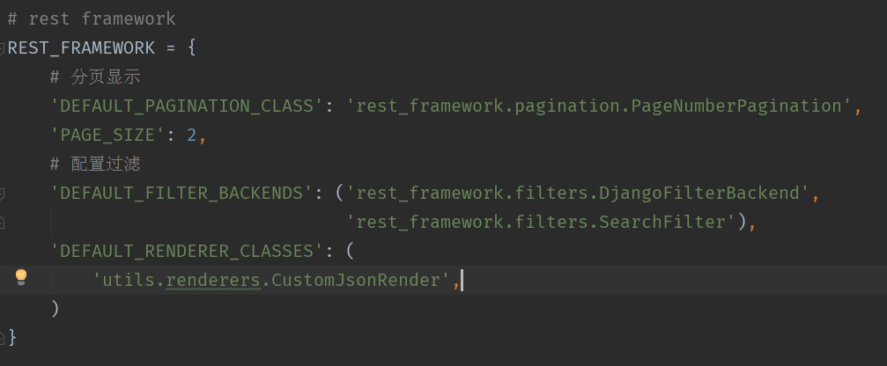
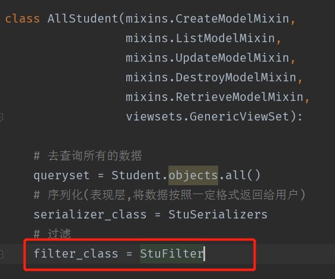
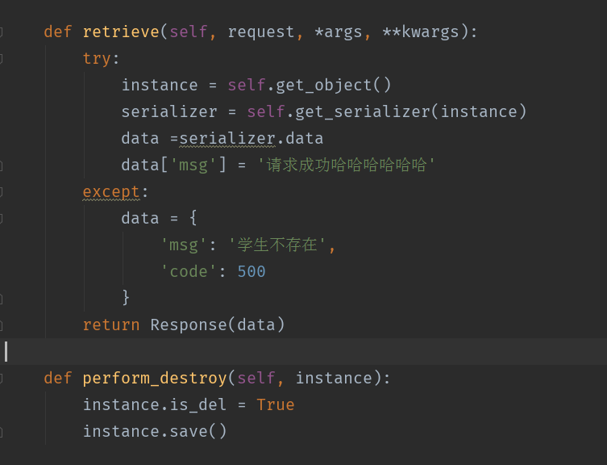

# restful使用指南3

>Auth: 雷力茏
>
>Date：2019-01-03
>
>Email：645393002@qq.com


### 1. 分页

修改settings.py配置文件，增加分页的配置信息


结果：


注意：在结果在data对应的value值中，有一个count的key，表示返回数据有3条，next表示下一个的url，previous表示上一页的url。


### 2. 过滤

修改settings.py配置文件，增加filter过滤的信息

#### 2.1 安装过滤的库

```
pip install django-filter
```

#### 2.2 配置settings.py的信息

配置DEFAULT_FILTER_BACKENDS

###### django2.0以下版本的配置



###### django2.0以上版本的过滤filter配置

    'DEFAULT_FILTER_BACKENDS': (
        'django_filters.rest_framework.DjangoFilterBackend',
    ),

#### 2.3 views中指定filter_class



#### 2.4 编写filter_class过滤信息

###### django2.0以下版本的配置


###### django2.0以上版本的配置

继承的父类修改为: django_filters.rest_framework.FilterSet，如下:

	class ArticleFiler(django_filters.rest_framework.FilterSet):


#### 2.5 实现方法

##### 2.5.1 查询学生的姓名中包含王的学生

使用filter_class进行过滤筛选：

	http://127.0.0.1:8080/stu/student/?name=王

不使用filter_class进行筛选：


##### 2.5.2 查询学生的创建时间在2018年1月1号到2018年6月1号的学生信息

使用filter_class进行过滤筛选：

	http://127.0.0.1:8080/stu/student/?create_min=2018-02-01&create_max_max=2018-0-01

不使用filter_class进行筛选：


##### 2.5.3 查询状态为休学的学生信息

	http://127.0.0.1:8080/stu/student/?status=LEAVE_SCH

##### 2.5.4 查询所有的学生，按照id从大到小排序


#### 2.6 拓展




